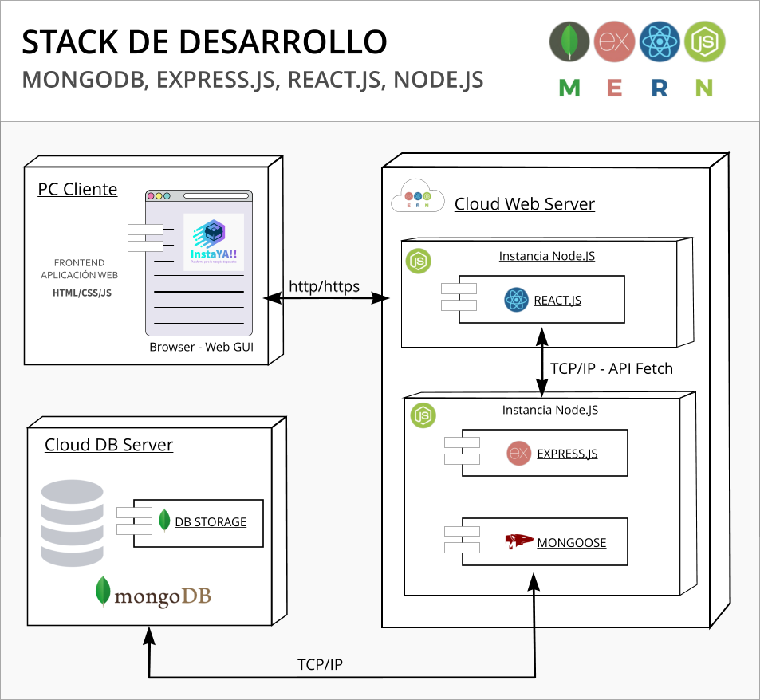

# Plataforma Recogida de Paquetes
## Sprint Ciclo IV Desarrollo de Aplicaciones Web - Misión - Tic 2022

### Proyecto Plataforma Recogida de Paquetes

_Proyecto basado en plantilla Bootstrap_

App-paquetes es una aplicacion básica desarrollada en React utilizando el Stack MERN

Su objetivo es didáctico y funciona como proyecto de evaluación de lo visto en el transcurso del ciclo 4 de Misión TIC Universidad del Norte en el contexto del diplomado __Misión TIC (22) - HABILIDADES EN PROGRAMACIÓN CON ÉNFASIS EN: APLICACIONES WEB // APLICACIONES MÓVILES__ . 

Corresponde a los requerimientos mínimos solicitados para la creación de un sistema de recogida de paquetes

**Grupo NRC**: 2240
**Equipo de Desarrollo** N° 11
**Integrantes**: 

* *Jose Rojas*
* *Jenny Alonso*
* *Diego Bejarano Cerezo*
* *Andres Mauricio Zuluaga*
* *Milton Satizabal*